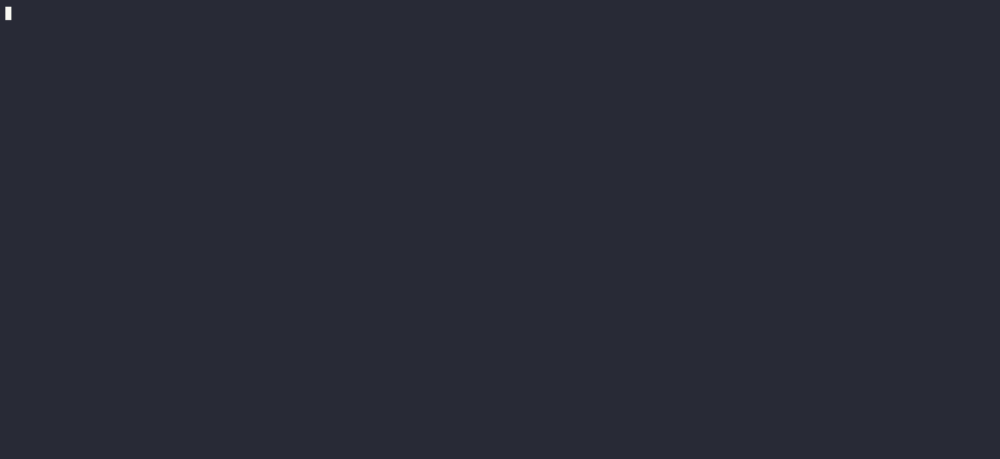

1. For testing the generation of Kubernetes manifest files, I used an alternative utility `ollama` and models: `llama2:7b, mistral`, as well as plugins for nvim like `gen.nvim`, `ogpt.nvim`, and also try `gpt4free`. My results are attached to the table below.

2. All manifest files you can find in directory `yaml`, here in table you acn see summary results. 

| Name | Prompt | Description | Example |
| :---: | :---: | :---: | :---: |
| Pod | create pod nginx | Create simple pod Nginx | [app-pod](./yaml/app.yaml) |
| LivenessProbe | create pod nginx with livenessprobe | Create nginx pod with livenessprobe | [LivenessProbe](./yaml/app-livenessProbe.yaml) |
| ReadinessProbe | create pod nginx with readinessprobe | Create nginx pod with readinessprobe | [ReadinessProbe](./yaml/app-readinessProbe.yaml) |
| VolumeMount | create pod with volume mounts path hostpath, nginx app name frontend | Pod Nginx with vol. mounts | [VolumeMount](./yaml/app-volumeMounts.yaml) |
| CronJob | create cronjob repeat print hello world every 5 min, busybox | Create CronJon repeat each 5 min | [CronJob](./yaml/app-cronjob.yaml) | 
| Job | create job with ping 1.1.1.1 five times| Create job use busybox ping 5 times | [Job](./yaml/app-job.yaml) |
| Multicontainer | Pod specification for an application with two containers: Nginx and busybox. The Pod has a single volume named "html" which is mounted at different paths in each container. The Nginx container is mounted at /usr/share/nginx/html while the busybox container is mounted at /html. The busybox container runs a command that updates the index.html file every second with the current date, and sleeps for 1 second between iterations | Create Multicontainer nginx and busybox | [Multicontainer](./yaml/app-multicontainer.yaml)
| Resources | create nginx pod with resources, livenesprobe, redinesprobe | Create nginx pod with resources | [Resources](./yaml/app-resources.yaml) |
| Secret-Env | generate pod redis and secret, use credential from environment variable, take username, pass from secret environment | Generate pod redis and secret | [Secret-Env](./yaml/app-secret-env.yaml) |
